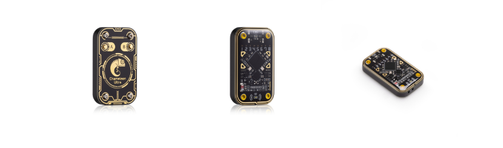

# ChameleonUltra Authorized Distributors

Lyon, France: [Lab401](https://lab401.com/)

Santa Ana, United States: [Hackerwarehouse](https://hackerwarehouse.com/)

Hastings, UK: [KSEC](https://labs.ksec.co.uk/product/proxgrind-chameleon-ultra/)

Montreal, Canada: [TechSecurityTools](https://techsecuritytools.com/product/chameleon-ultra/)

Shenzhen, China: [Sneaktechnology](https://sneaktechnology.com)

Guangdong, China: [MTools Tec](https://shop.mtoolstec.com/)

Lazada One, Singapore: [Aliexpress by RRG](https://proxgrind.aliexpress.com/store/1101312023)

# What is it and how to use ?

Read the [available documentation](https://github.com/RfidResearchGroup/ChameleonUltra/wiki).

# Compatible applications

* [ChameleonUltraGUI](https://github.com/GameTec-live/ChameleonUltraGUI)
* [MTools BLE](https://github.com/RfidResearchGroup/ChameleonUltra/wiki/mtoolsble)

# Videos

*Beware some of the instructions might have changed since recording, check the current documentation when in doubt!*

* [Downloading and compiling the official CLI](https://www.youtube.com/watch?v=VGpAeitNXH0)
* [Downloading ChameleonUltraGUI](https://www.youtube.com/watch?v=rHH7iqbX3nY)
* [ChameleonUltraGUI features overview](https://www.youtube.com/watch?v=YqE8wyVSse4)
* [Using ChameleonUltraGUI and the Chameleon Ultra](https://www.youtube.com/watch?v=9jtKNJ5-kVY)
* [MTools BLE - How to clone a card with ChameleonUltra](https://youtu.be/IvH-xtdW1Wk?si=4exqgAAeJ-kxU3aN)

# Official channels

Where do you find the community?
* [RFID Hacking community discord server](https://t.ly/d4_C)
  * Software/chameleon-dev for firmware and clients development discussions
  * Devices/chameleon-ultra for usage discussions
* [GameTec_live discord server](https://discord.gg/DJ2A4wxncK)

###### Searching for the docs repo? Find it [here](https://github.com/RfidResearchGroup/ChameleonUltraDocs)