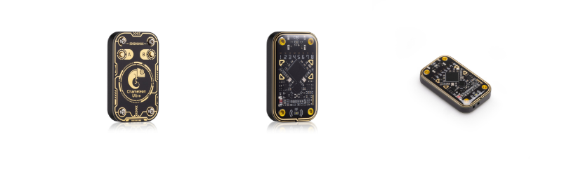

> [!IMPORTANT]
> **This is a fork — not the upstream ChameleonUltra repository.**
> 
> If you’re looking for the official firmware, releases, or distributor
> links, go to **[RfidResearchGroup/ChameleonUltra](https://github.com/RfidResearchGroup/ChameleonUltra)**.
> This fork modifies the bootloader; everything else below is preserved
> from upstream for reference.

# About this fork

This repository replaces the stock signed-DFU bootloader with a **UF2
drag-and-drop bootloader**. After installation, firmware updates become
as simple as copying a `.uf2` file onto a USB mass-storage drive — no
`nrfutil`, no signed packages, no driver install for day-to-day
updates.

- **Maintainer:** [nieldk](https://github.com/nieldk) · [sec1.dk](https://sec1.dk)
- **Active branch:** [`UF2`](https://github.com/nieldk/ChameleonUltra/tree/UF2)
- **Upstream:** [RfidResearchGroup/ChameleonUltra](https://github.com/RfidResearchGroup/ChameleonUltra)

## What’s different from upstream

- **UF2 bootloader** replaces Nordic’s Secure DFU. Drag a `.uf2` file
  onto the `CHAMELEON` drive — no signing infrastructure required for
  development builds.
- **`bl_updater`** mechanism in the application for bootstrapping new
  bootloaders without SWD. Embeds a freshly-built bootloader in the
  application’s `.rodata` and writes it to flash via a CLI command.
- **Revert-to-stock UF2** lets you restore the upstream signed-DFU
  bootloader at any time with a single drag-and-drop. See
  [`firmware/tools/RECOVERY_BUILD.md`](firmware/tools/RECOVERY_BUILD.md).
- Application functionality is otherwise unchanged from upstream — the
  same NFC/RFID research firmware, the same CLI protocol, the same
  ChameleonUltraGUI compatibility.

## Documentation specific to this fork

- **[Installation guide](firmware/tools/UF2_INSTALL.md)** — clone, build, flash to a
  stock device, and verify the UF2 bootloader is working.
- **[Recovery / revert-to-stock](firmware/tools/RECOVERY_BUILD.md)** —
  building and using the revert-to-stock UF2 for users who want to
  return to upstream firmware.
- **[Design deep dive](https://sec1.dk/blog/uf2-on-chameleon.html)** —
  the engineering story behind the port, including the debugging path
  through Windows PnP cache, the descriptor bug, and the bl_updater
  bootstrap mechanism.

-----

# Upstream README (preserved for reference)

# ChameleonUltra Authorized Distributors

Lyon, France: [Lab401](https://lab401.com/)

Santa Ana, United States: [Hackerwarehouse](https://hackerwarehouse.com/)

Hastings, UK: [KSEC](https://labs.ksec.co.uk/product/proxgrind-chameleon-ultra/)

Montreal, Canada: [TechSecurityTools](https://techsecuritytools.com/product/chameleon-ultra/)

Shenzhen, China: [Sneaktechnology](https://sneaktechnology.com)

Guangdong, China: [MTools Tec](https://shop.mtoolstec.com/)

Lazada One, Singapore: [Aliexpress by RRG](https://proxgrind.aliexpress.com/store/1101312023)

# What is it and how to use ?

Read the [available documentation](https://github.com/RfidResearchGroup/ChameleonUltra/wiki).

# Compatible applications

- [ChameleonUltraGUI](https://github.com/GameTec-live/ChameleonUltraGUI)
- [MTools BLE](https://github.com/RfidResearchGroup/ChameleonUltra/wiki/mtoolsble)
- [Mifare Chameleon Tool (iOS only, Beta)](https://apps.apple.com/it/app/mifare-chameleon-tool/id6761231484)
- [Chameleon Ultra (Sailfish OS only)](https://sailfishos-chum.github.io/apps/harbour-chameleon-ultra)

# Videos

*Beware some of the instructions might have changed since recording, check the current documentation when in doubt!*

- [Downloading and compiling the official CLI](https://www.youtube.com/watch?v=VGpAeitNXH0)
- [Downloading ChameleonUltraGUI](https://www.youtube.com/watch?v=rHH7iqbX3nY)
- [ChameleonUltraGUI features overview](https://www.youtube.com/watch?v=YqE8wyVSse4)
- [Using ChameleonUltraGUI and the Chameleon Ultra](https://www.youtube.com/watch?v=9jtKNJ5-kVY)
- [MTools BLE - How to clone a card with ChameleonUltra](https://youtu.be/IvH-xtdW1Wk?si=4exqgAAeJ-kxU3aN)

# Official channels

Where do you find the community?

- [RFID Hacking community discord server](https://t.ly/d4_C)
  - Software/chameleon-dev for firmware and clients development discussions
  - Devices/chameleon-ultra for usage discussions
- [GameTec_live discord server](https://discord.gg/DJ2A4wxncK)

###### Searching for the docs repo? Find it [here](https://github.com/RfidResearchGroup/ChameleonUltraDocs)
