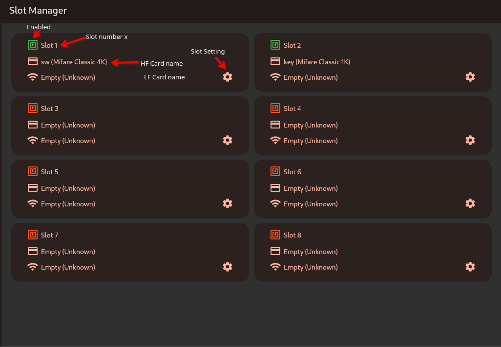
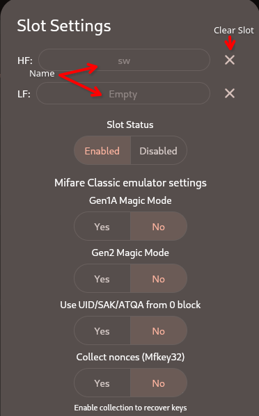
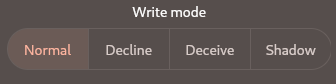
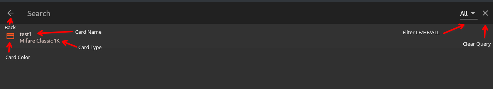
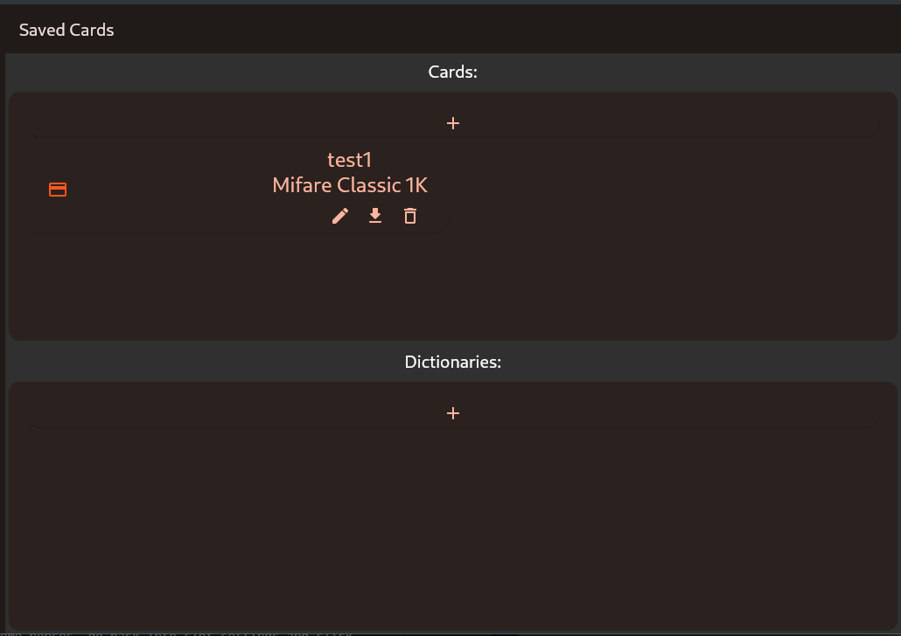
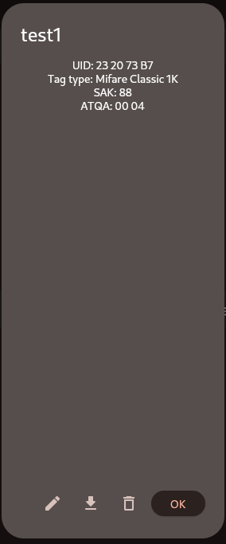
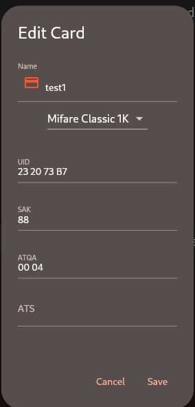
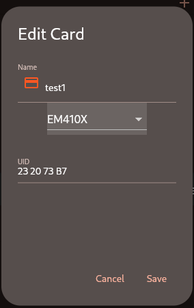
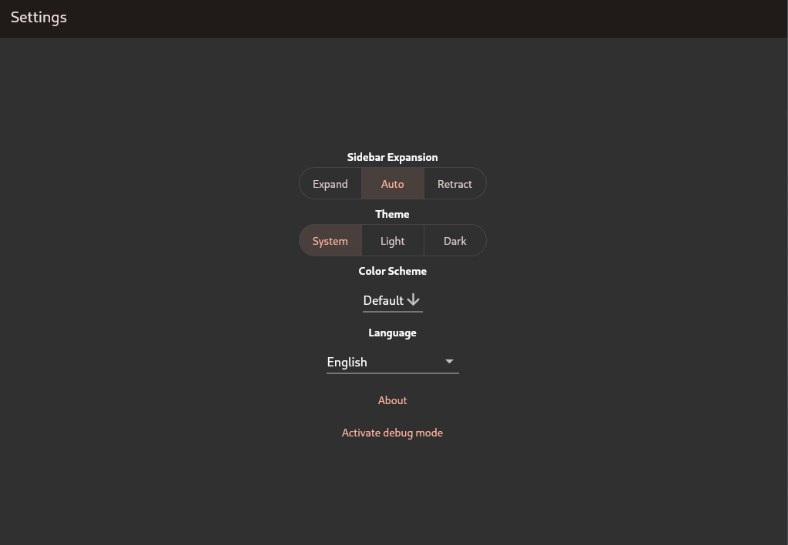

## Get ChameleonUltraGUI

- [on Google Play](https://play.google.com/store/apps/details?id=io.chameleon.ultra) / [APK](https://nightly.link/GameTec-live/ChameleonUltraGUI/workflows/buildapp/main/apk.zip)
- [on iOS](https://apps.apple.com/dk/app/chameleon-ultra-gui/id6462919364)
- [on Windows](https://nightly.link/GameTec-live/ChameleonUltraGUI/workflows/buildapp/main/windows-installer.zip) ([or without installer](https://nightly.link/GameTec-live/ChameleonUltraGUI/workflows/buildapp/main/windows.zip))
- [on Linux](https://nightly.link/GameTec-live/ChameleonUltraGUI/workflows/buildapp/main/linux.zip)
- [on macOS](https://apps.apple.com/app/chameleon-ultra-gui/id6462919364)

## Page Breakdown

### Homepage


Starting from the top left youll find:

- The device name: This says Chameleon Ultra or Chameleon Lite depending on the device connected
- The disconnect button: Pressing this icon cleanly disconnects the Chameleon, it is recommended to use this button whenever possible
- The connected port tells you where and how the chameleon is connected, followed by how it is connected (Connection Method), this displays a USB or bluetooth icon and last in that row is the battery charge display
- The used slots displays how many out of the 8 slots are used
- The Slotchanger: The currently selected slot is highlighted with a red circle, slots that cotain a card are filled out, everything else is a hollow circle. The arrows left and right allow you to change the currently selected slot.
- The Firmware version is pulled from the device and displays the version as well as the tag
- The check for updates button compares the firmware with github and then updates if a newer version is available
- Switch mode allows you to switch between reader and emulator mode, updating the icon accordingly
- The device settings allow you to change settings concerning the device, like changing the animation mode

### Device settings


Top to bottom:
- Enter DFU mode: Enters the devices DFU mode. Allows the user to take over.
- Flash latest FW via DFU: Downloads the newest firmware from github, disregarding if the device is already up to date and flashes it.
- Flash .zip FW via DFU: Allows the user to select a zip theyd like to flash to the device
- The animation setting chooses if the device should play the bootup animation when brought into a RFID field
- The button config allows you to define both shortpress and longpress actions
- The BLE pairing toggle decides wheter pairing with a BLE Pin is required or not, enabling this increases security at the loss of convinience. Your able to set the Pin once pairing is enabled.
- Reset settings: resets all device settings but does not wipe user data
- Factory reset: **WIPES ALL USERDATA** and resets the device to factory settings

### Slotmanager


The Slotmanager consits of 8 cards which represent the 8 Slots on the device.

The NFC icon in the top left corner can either be green or red, meaning the slot is enabled and disabled respectivly.

The credit card icon displays the name and cardtype of the HF card in the slot.
The wifi symbol on the other hand dispays name and cardtype of the LF card in the slot.

The settings gear opens the slot settings. These settings can be changed per slot.

The entire card is also one big button, pressing anywhere on the card opens the select dialog for loading a card.

### Slot Settings



The two rows at the top, labled HF and LF respectivly, display the names of the currently loaded cards. Next to them theres a X, this X clears them out of the slot. If both are empty the slot will automatically be disabled.

Under Slot Status you can set if the slot is enabled or disabled.

The Mifare Classic emulator settings allow you to toggle various behaviours:
- Gen1A Magic Mode: Behaves like a gen1a magic card and allows writing to it using magic commands like the pm3s `cload`
- Gen2 Magic Mode: Behaves like a gen2 magic card, makes Block 0 writable
- Use UID/SAK/ATQA from 0 block: The Chameleon Ultra stores the UID, etc, to emulate seperatly, enabling this setting tells the Chameleon to use them from block 0 and disregard the other.
- Collect nonces (Mfkey32): This toggle toggles nonce collection for mfkey32. When enabled youll be prompted to present the Chameleon to a reader, after you have collected nonces the "Present Chameleon to reader" message will change into a "Recover Keys from x nonces" button. Pressing this will start the recovery process.
- Write mode: Please refer to the [firmware docs](./firmware.md)

### Search dialog


When using the GUI you may encounter a search dialog. The dialog is structured as follows:

Top left you find the Back button, this will abort the selection and bring you back.

Near the end of the row, if its a card search dialog, a filter option will show. This allows you to filter between HF, LF and ALL cards.

At the end you find a X, this X will clear the query.

You enter the queary into the (only textbox in this dialog) textbox with the placeholder texxt "Search"

The searchresults get listed below. The Card or Wifi symbol indicates if its LF/HF. The color of the Icon is the user defined color.

Listed also is the name and type.

Selecting the entry automatically closes the search.

### Saved Cards


The saved cards page allows you to manage your cards and dictionaries.

You import a card or dictionary by clicking the + Button in their respective half. This opens a select dialog. You may then either select a CUGUI Json file or a Bin file. A Json file gets imported immideatly while a Bin file asks if the supplied data is correct before saving.

Once again, we got a card per card or dictionary. At the left you find the Icon for HF/LF with the userdefined color. To the left of that the card name, type and quickactions for edit, export and delete.

The Card is again one Big button, pressing it brings up the Slot info. It displays info about the selected item and also has the quickactions present at the bottom.



### Card Edit Menu



Depending on the selected card type the menu only displays options applicable to it.
At the top of the menu is the name and icon. Pressing on the icon allows you to change the color.

Right below is the dropwdown for the type. You may switch between any type at will.

A bit lower again you find the UID, SAK, ATQA, ATS and all other options for the selected type. This form autovalidates, so you shouldnt be able to save a invalid config.

And finally at the bottom are the save and cancel options. Save, saves the changes and exits, cancels cancels the operation with no changes.

### Settings


The Appsettings are its own page and consist of a few simple settings:
- Wether or not the sidebar shall be expanded or if the windows size should decide that
- The Theme: Light/Dark or get it from the System
- Color Scheme: Allows you to choose a color you like for the app
- Language: Choose any of the languages available. Translating is done via our Crowding project.
- About: Displays simple info about the app, such as build number, contributors and people who have donated on Opencollective
- Activate debug mode: Dont, just Dont

## How to use MFKEY32

- set slot to mifare classic (by uploading an empty dump)
- enable mfkey32 for that slot (toggle in slot settings)
- select slot and present ultra repeatedly to the reader in order to collect nonces
- after collecting some nonces, go back into slot settings and click recover keys

## Troubleshooting

### Font scaling issues on HiDPI screens

If you have font scaling issues (tiny fonts) with the Linux desktop app and a HiDPI screen, you can solve it by running the app as
```
GDK_SCALE=2 GDK_DPI_SCALE=0.5 /usr/local/lib/chameleonultragui/chameleonultragui
```

### Key recovery from this card is not yet supported
This error may occur when the card you are trying to recovery keys from is requiring a not yet supported recovery technology. You can not tell the required recovery method from the outside.

You may be able to solve this issue by dumping the card with a Proxmark3 or Mifare Classic Tool (Mobile App) and then importing a bin file.