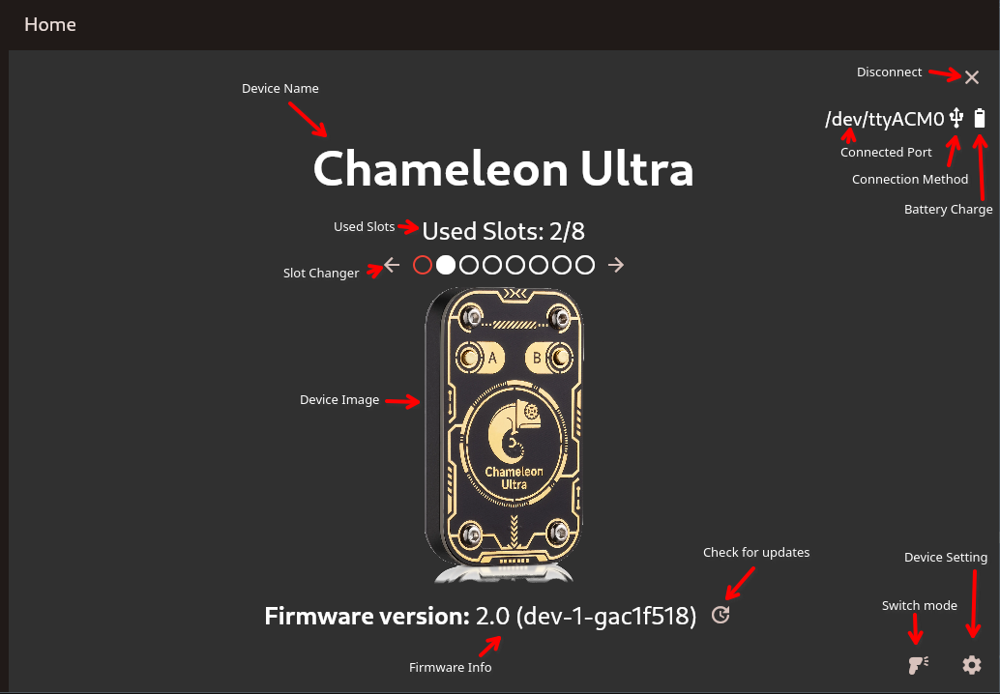
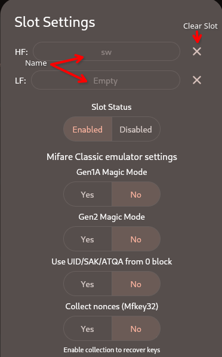
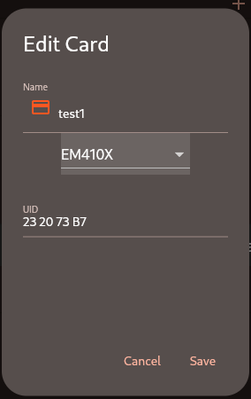
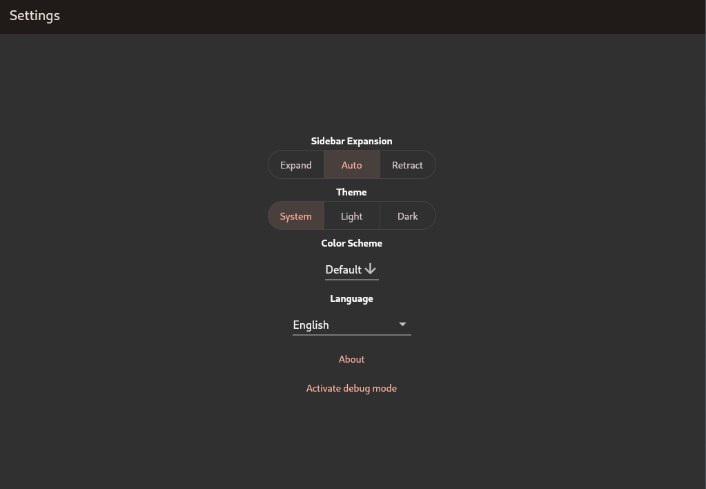

## Get ChameleonUltraGUI

- [on Google Play](https://play.google.com/store/apps/details?id=io.chameleon.ultra) / [APK](https://nightly.link/GameTec-live/ChameleonUltraGUI/workflows/build-app/main/apk.zip)
- [on iOS](https://apps.apple.com/dk/app/chameleon-ultra-gui/id6462919364)
- [on Windows](https://nightly.link/GameTec-live/ChameleonUltraGUI/workflows/build-app/main/windows-installer.zip) ([or without installer](https://nightly.link/GameTec-live/ChameleonUltraGUI/workflows/build-app/main/windows.zip))
- [on Linux](https://nightly.link/GameTec-live/ChameleonUltraGUI/workflows/build-app/main/linux.zip)
- [on macOS](https://apps.apple.com/app/chameleon-ultra-gui/id6462919364)

## Page Breakdown

### Homepage


Starting from the top left, you find

- the *Device Name*: `Chameleon Ultra` or `Chameleon Lite` depending on the device connected ;
- the *Disconnect* button: pressing this icon cleanly disconnects the Chameleon. It is recommended to use this button whenever possible ;
- the *Connected Port*: it tells you where and how the chameleon is connected, followed by how it is connected (*Connection Method*), which displays a USB or Bluetooth icon ;
- the *Battery Charge* icon: you can press it long to get more details. Note that it is refreshed only when reopening the Homepage ;
- the *Used Slots*: it displays how many out of the 8 slots are used ;
- the *Slot Changer*: the currently selected slot is highlighted with a red circle, while enabled slots are filled in. Everything else is a hollow circle. The arrows left and right allow you to change the currently selected slot ;
- the *Firmware version*: the version is pulled from the device displayed, as well as git commit information ;
- the *Check for updates* button: it compares the firmware with the one available on GitHub and then updates if a newer version is available ;
- the *Switch mode* button: use it to switch between reader and emulator modes. The icon will update accordingly ;
- the *Device Setting* button: it allows you to change settings concerning the device, like changing the animation mode.

### Device settings


Top to bottom:
- *Enter DFU mode*: to enter the device DFU mode. Allows the user to take over ;
- *Flash latest FW via DFU*: download the newest firmware from GitHub, disregarding if the device is already up to date, and flash it ;
- *Flash .zip FW via DFU*: it allows the user to select a zip they would like to flash to the device ;
- *Animations*: choose if the device should play the boot-up animation when woken up by an external RFID field ;
- *Button config*: it allows you to define both short-press and long-press actions
- *BLE pairing* toggle: you can decide whether pairing with a BLE PIN is required or not. Enabling PIN increases security at the loss of convenience. You can define a *BLE PIN* once pairing is enabled and you can force forgetting about existing pairings with the *Clear bounded devices* option.
- *Reset settings*: it resets all device settings but does not wipe user data.
- *Factory reset*: **IT WIPES ALL USER DATA** and resets the device to factory settings.

### Slot Manager


The *Slot Manager* consists of 8 cards representing the 8 slots on the device.

The *RFID icon* in the top left corner can either be green or red, meaning the slot is enabled and disabled respectively.

The *Credit Card icon* displays the name and card type of the HF card in the slot.
The *Wi-Fi icon*, on the other hand, displays the name and card type of the LF card in the slot.

The *Gear icon* opens the slot settings. These settings can be changed per slot.

The entire card is also one big button, pressing anywhere on the card opens the select dialog for loading a card.

### Slot Settings



The two rows at the top, labeled HF and LF respectively, display the names of the currently loaded cards. Next to them, the *X* clears them out of the slot. If both are empty, the slot will automatically be disabled.

Under *Slot Status* you can set if the slot is enabled or disabled.

The *Mifare Classic emulator settings* section allows you to toggle various behaviors:
- *Gen1A Magic Mode*: behaves like a gen1a magic card and allows writing to it using magic commands like the Proxmark3 `cload` ;
- *Gen2 Magic Mode*: behaves like a gen2 magic card, makes Block 0 writable ;
- *Use UID/SAK/ATQA from 0 block*: the Chameleon Ultra stores the UID and other anti-collision data independently of the card content. Enabling this setting tells the Chameleon to derive them from card content block 0. Only for MFC with 4-byte UID ;
- *Collect nonces (Mfkey32)*: it toggles nonce collection for mfkey32. When enabled you will be prompted to present the Chameleon to a reader. After you have collected nonces the *Present Chameleon to reader* message will change into a *Recover Keys from x nonces* button. Pressing this will start the recovery process ;
- *Write mode*: Please refer to the [firmware docs](./firmware.md).

### Search dialog


When using the GUI you may encounter a *Search* dialog. The dialog is structured as follows:

Top left you find the *Back* button, this will abort the selection and bring you back.

Near the end of the row, if it is a card search dialog, a filter option will show. This allows you to filter between *HF*, *LF* and *All* cards.

At the end you find a *X*, this X will clear the query.

You enter the query into the *textbox* on the top with the placeholder text "Search"

The search results get listed below. The Card or Wi-Fi symbol indicates if it is LF/HF. The color of the Icon is the user-defined color.

Listed also are the name and type.

Selecting the entry automatically closes the search.

### Saved Cards


The *Saved Cards* page allows you to manage your cards and dictionaries.

You import a card or dictionary by clicking the *+* button in their respective half. This opens a select dialog. You may then either select a CUGUI Json file or a Bin file. A Json file gets imported immediately while a Bin file asks if the supplied data is correct before saving.

Once again, we got a card per card or dictionary. At the left you find the Icon for HF/LF with the user-defined color. To the left of that the card name, type and quick actions for edit, export and delete.

The Card is again one Big button, pressing it brings up the Slot info. It displays info about the selected item and also has the quick actions present at the bottom.


### Card Edit Menu



Depending on the selected card type the menu only displays options applicable to it.
At the top of the menu is the name and icon. Pressing on the icon allows you to change the color.

Right below is the drop-down for the type. You may switch between any type at will.

A bit lower again you find the UID, SAK, ATQA, ATS and all other options for the selected type. This form auto-validates, so you should not be able to save a invalid config.

And finally at the bottom are the save and cancel options, to save the changes and exits, or to cancel the operation with no changes.

### Settings


The App settings have their own page and consist of a few simple settings:
- *Sidebar Expansion*: Whether or not the sidebar shall be expanded or if the windows size should decide that
- *Theme*: Light/Dark or get it from the System
- *Color Scheme*: Allows you to choose a color you like for the app
- *Language*: Choose any of the languages available. Translating is done via our Crowding project.
- *About*: Displays simple info about the app, such as build number, contributors and people who have donated on Opencollective
- *Activate debug mode*: Don't, just Don't

## How to use MFKEY32

- set slot to MIFARE Classic (by uploading an empty dump)
- enable mfkey32 for that slot (toggle in slot settings)
- select slot and present ultra repeatedly to the reader in order to collect nonces
- after collecting some nonces, go back into slot settings and click recover keys

## Troubleshooting

### Font scaling issues on HiDPI screens

If you have font scaling issues (tiny fonts) with the Linux desktop app and a HiDPI screen, you can solve it by running the app as
```
GDK_SCALE=2 GDK_DPI_SCALE=0.5 /usr/local/lib/chameleonultragui/chameleonultragui
```

### Key recovery from this card is not yet supported
This error may occur when the card you are trying to recovery keys from is requiring a not yet supported recovery technology. You cannot tell the required recovery method from the outside.

You may be able to solve this issue by dumping the card with a Proxmark3 or Mifare Classic Tool (Mobile App) and then importing a bin file.

### Error: Invalid data length
This error may occur on windows devices and seems to be a deeper bug in the serial library.

Reconnecting the device may solve it, also make sure that the App and Firmware are up to date.