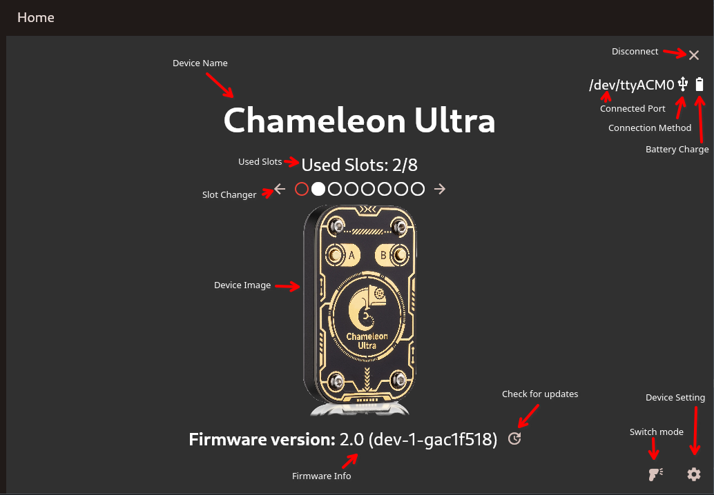
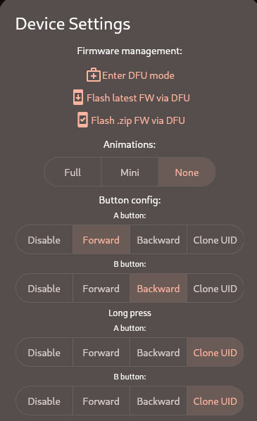
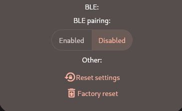

## Get ChameleonUltraGUI

- [on Google Play](https://play.google.com/store/apps/details?id=io.chameleon.ultra) / [APK](https://nightly.link/GameTec-live/ChameleonUltraGUI/workflows/buildapp/main/apk.zip)
- [on iOS](https://apps.apple.com/dk/app/chameleon-ultra-gui/id6462919364)
- [on Windows](https://nightly.link/GameTec-live/ChameleonUltraGUI/workflows/buildapp/main/windows-installer.zip) ([or without installer](https://nightly.link/GameTec-live/ChameleonUltraGUI/workflows/buildapp/main/windows.zip))
- [on Linux](https://nightly.link/GameTec-live/ChameleonUltraGUI/workflows/buildapp/main/linux.zip)
- [on macOS](https://apps.apple.com/app/chameleon-ultra-gui/id6462919364)

## Page Breakdown

### Homepage


Starting from the top left youll find:

- The device name: This says Chameleon Ultra or Chameleon Lite depending on the device connected
- The disconnect button: Pressing this icon cleanly disconnects the Chameleon, it is recommended to use this button whenever possible
- The connected port tells you where and how the chameleon is connected, followed by how it is connected (Connection Method), this displays a USB or bluetooth icon and last in that row is the battery charge display
- The used slots displays how many out of the 8 slots are used
- The Slotchanger: The currently selected slot is highlighted with a red circle, slots that cotain a card are filled out, everything else is a hollow circle. The arrows left and right allow you to change the currently selected slot.
- The Firmware version is pulled from the device and displays the version as well as the tag
- The check for updates button compares the firmware with github and then updates if a newer version is available
- Switch mode allows you to switch between reader and emulator mode, updating the icon accordingly
- The device settings allow you to change settings concerning the device, like changing the animation mode

### Device settings



Top to bottom:
- Enter DFU mode: Enters the devices DFU mode. Allows the user to take over.
- Flash latest FW via DFU: Downloads the newest firmware from github, disregarding if the device is already up to date and flashes it.
- Flash .zip FW via DFU: Allows the user to select a zip theyd like to flash to the device
- The animation setting chooses if the device should play the bootup animation when brought into a RFID field
- The button config allows you to define both shortpress and longpress actions
- The BLE pairing toggle decides wheter pairing with a BLE Pin is required or not, enabling this increases security at the loss of convinience. Your able to set the Pin once pairing is enabled.
- Reset settings resets all device settings but does not wipe user data
- Factory reset **WIPES ALL USERDATA** and resets the device to factory settings

## How to use MFKEY32

- set slot to mifare classic (by uploading an empty dump)
- enable mfkey32 for that slot (toggle in slot settings)
- select slot and present ultra repeatedly to the reader in order to collect nonces
- after collecting some nonces, go back into slot settings and click recover keys

## Troubleshooting

### Font scaling issues on HiDPI screens

If you have font scaling issues (tiny fonts) with the Linux desktop app and a HiDPI screen, you can solve it by running the app as
```
GDK_SCALE=2 GDK_DPI_SCALE=0.5 /usr/local/lib/chameleonultragui/chameleonultragui
```

### Key recovery from this card is not yet supported
This error may occur when the card you are trying to recovery keys from is requiring a not yet supported recovery technology. You can not tell the required recovery method from the outside.

You may be able to solve this issue by dumping the card with a Proxmark3 or Mifare Classic Tool (Mobile App) and then importing a bin file.