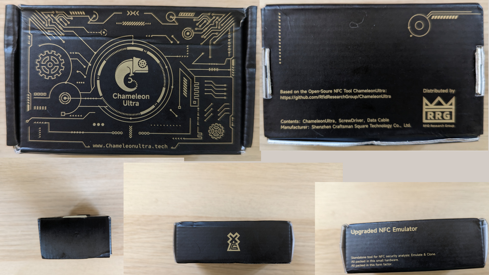
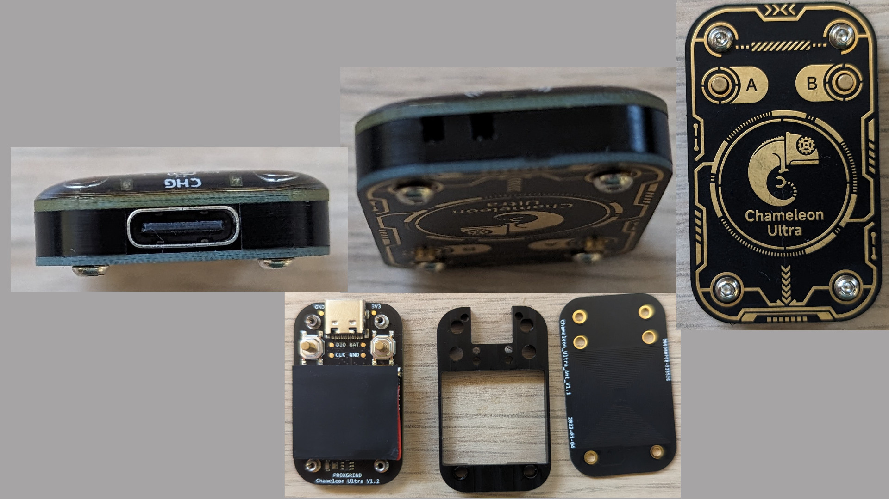
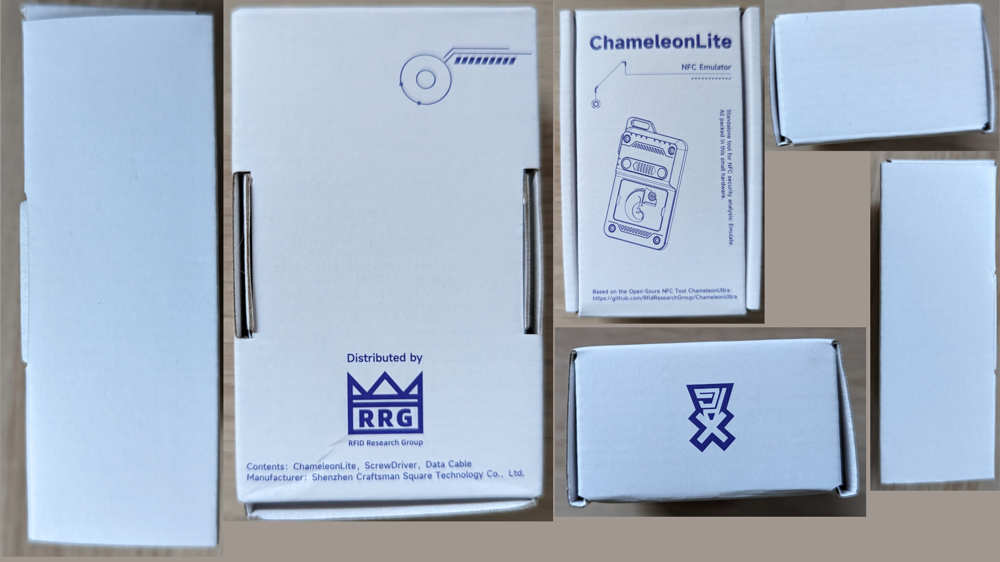
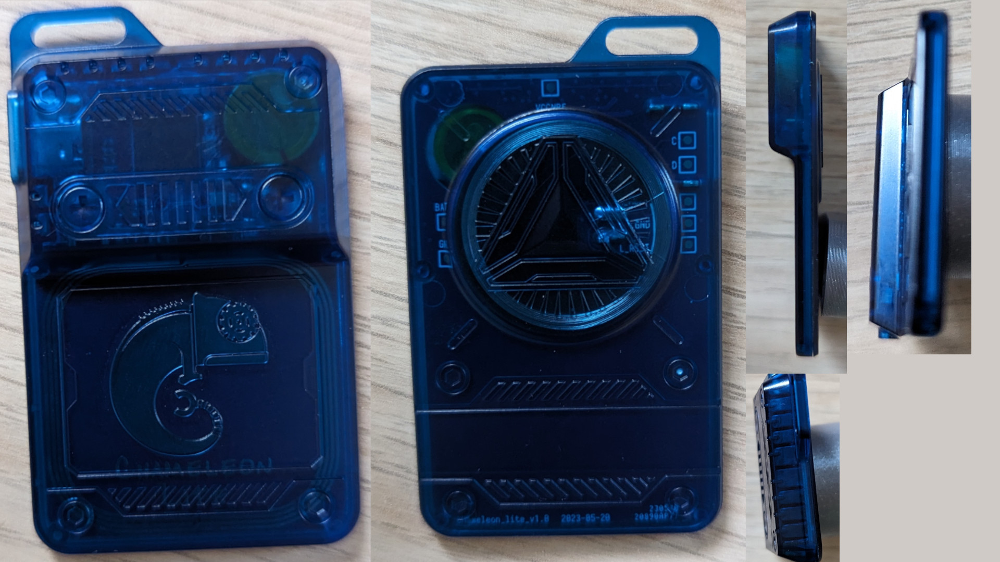
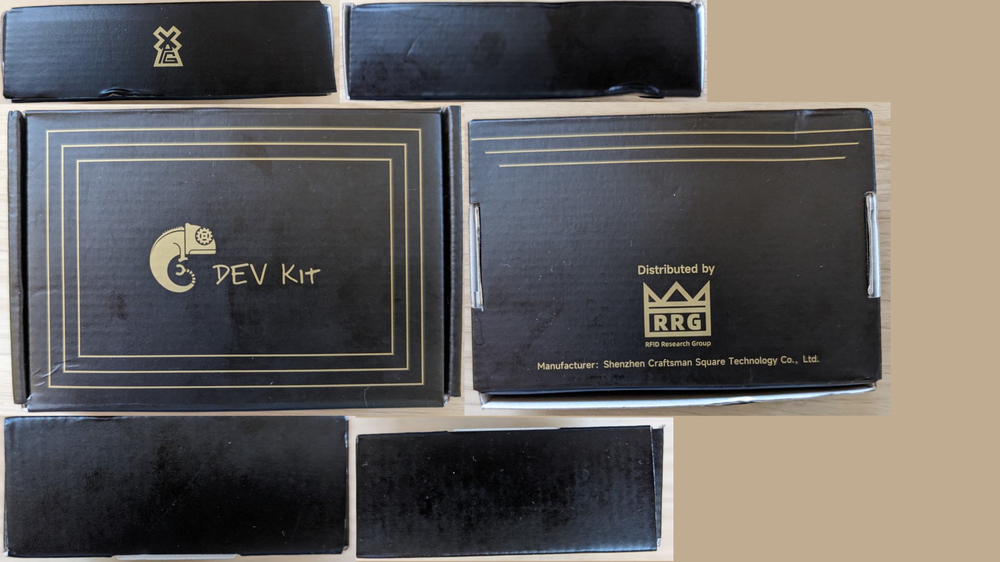
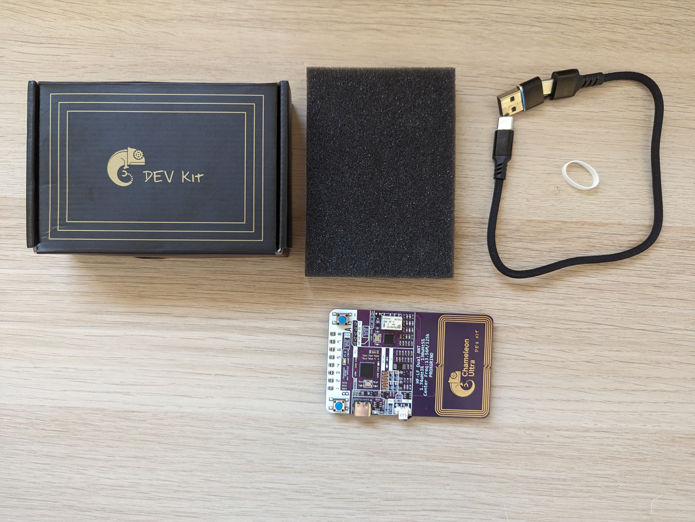
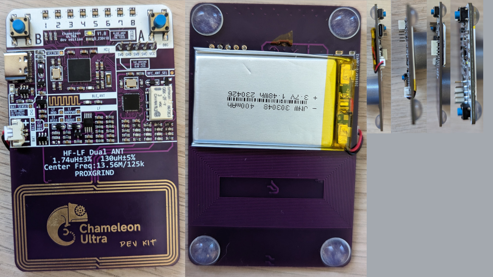

# Hardware

The Chameleon comes in 3 Hardware variants, the Ultra, the Lite and the Devkit.

## The Ultra

The Chameleon Ultra comes in a black box with gold printing. This box has the dimensions: 9.5cm x 5.5cm x 3.5cm

The Box contains a foam pad, a USB cable that has a removable end to convert it to USB-C, a Proxgrind 3.5 hex screwdriver, 2 replacement screws and a keychain and the device itself.

The device itself features 4 screws holding it together, 2 buttons labeled `A` and `B`.  The device consists of 2 PCBs (**P**rinted **C**ircuit **B**oards) and a plastic spacer, one contains the Electronic and the HF (**H**igh **F**requency), 13.56 MHz, antenna as well as the 8 LEDs indicating which slot is currently active and the other board features the Chameleon Ultra text, the screws and the LF (**L**ow **F**requency), 125KHz, antenna. The plastic spacer houses the battery as well as the ferrite pad which enables HF and LF emulation at the same time. It also has has the USB-C charging and data port and a hole for inserting the keychain loop. The Chameleon Ultra dimensions are: 2.4cm x 4cm x 8mm 

## The Lite

The Chameleon Lite comes in a white box with blue printing. This box has the following dimensions: 9.5 cm x 6 cm x 3.5 cm

The Box contains a foam pad, a USB cable that has a removable end to convert it to USB-C and the device itself.

The device itself features 2 Buttons labled with arrows. The Device consists of one PCB in a blue plastic housing. This one PCB contains the Electronic and the HF, antenna as well as the 8 Leds indecating which is currently active and the USB-C port. The LF antenna is glued onto the back of the PCB and is visible through the housing. The Battery is soldered in place and the housing is hold together by thin fragile pins which are easy to snap, it is not designed to be disassembled. The Keychain Loop is also relatively fragile so be careful. The Chameleon Lites dimensions are: 3.6cm x 6.1cm x 8mm

## The Devkit

Just like the Chameleon Ultra, the Devkit comes in a black box with gold printing. This box has the dimensions: 12cm x  8cm x 3.5cm

Again, just like the lite, the box contains a foam pad, a USB cable that has a removable end to convert it to USB-C and the device itself.

The deivce itself features 2 Buttons labled `A` and `B`. The Device is only one PCB without a case. At the bottom of this PCB both the HF and LF coil are found. Because its a Devkit, this Chameleon has its SWD (**S**ingle **W**ire **D**ebug) port and some testpoints exposed. (In the photos below a pinheader is already soldered into the SWD port, this is not the case from factory) The Chameleon Devkits dimensions are:  5.3cm x 8.5cm x 5mm (with rubber feet, 1.5mm without)

## Whats the difference?

The Chameleon Ultra as well as the Dev Kit contain a second chip called [MFRC522 ](https://www.nxp.com/docs/en/data-sheet/MFRC522.pdf) this chip allows the Chameleon to read and write. The Chameleon Lite does not contain this chip and therefore can not rea and write, only simulate. The Chameleon Lite also swaps the big LIPO (**LI**thium **PO**lymer) battery with a smaller buttoncell. The Devkit is a Chameleon Ultra on a bigger PCB and with a bigger battery.

# 