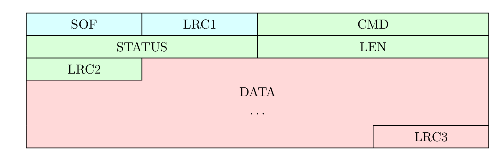

# Protocol description

## Versioning

Global firmware+CLI versions are following the [semantic versioning](https://semver.org/) logic mostly regarding the protocol version, so third party clients (GUIs, mobile apps, SDKs) can rely on firmware version to know their level of compatibility.

Given a version number MAJOR.MINOR.PATCH, we will increment the:
* MAJOR version when we are breaking the existing protocol format
* MINOR version when we are extending the protocol format in a backward compatible manner (new commands,...)
* PATCH version when we are releasing bugfixes not affecting the protocol description

Besides compatibility with a given firmware version, third party clients may choose to offer to the users the possibility to follow a stable release channel (installing only tagged releases) or the development channel (installing latest commits).

For the stable channel, a client compatible with versions X.y.z can accept any version > X.y'.z' but should refuse to work with a version X'>X.

For the development channel, a client compatible with versions X.y.z can accept any latest commit unless a tag X'.0.0 with X'>X is present in the repo, indicating that the corresponding commit and all the commits above are incompatible with the client version. There is still a non negligible risk that breaking changes are pushed while forgetting about putting a new tag, or artefacts being built before the tag being pushed. Here be dragons... It's always a good practice for the client to validate whatever data is transmitted by the firmware, and fail gracefully in case of hiccups.

Cf [GET_APP_VERSION](#1000-get_app_version) and [GET_GIT_VERSION](#1017-get_git_version).

When `GET_GIT_VERSION` returns only a tag and no commit hash info (on a release tag), one can query the corresponding hash with the GitHub API, e.g.
```
"4747d3884d21e0df8549e3029a920ea390e0b00a"
```
## Frame format

The communication between the firmware and the client is made of frames structured as follows:



- **SOF**: `1 byte`, "**S**tart-**O**f-**F**rame byte" represents the start of a packet, and must be equal to `0x11`.
- **LRC1**: `1 byte`, LRC over `SOF` byte, therefore must be equal to `0xEF`.
- **CMD**: `2 bytes`, each command have been assigned a unique number (e.g. `DATA_CMD_SET_SLOT_TAG_NICK` = `1007`).
- **STATUS**: `2 bytes`.
  - From client to firmware, the status is always `0x0000`.
  - From firmware to client, the status is the result of the command.
- **LEN**: `2 bytes`, length of the `DATA` field, maximum is `512`.
- **LRC2**: `1 byte`, LRC over `CMD|STATUS|LEN` bytes.
- **DATA**: `LEN bytes`, data to be sent or received, maximum is `512 bytes`. This payload depends on the exact command or response to command being used. See [Packet payloads](#packet-payloads) below.
- **LRC3**: `1 byte`, LRC over `DATA` bytes.

Notes:
* The same frame format is used for commands and for responses.
* All values are **unsigned** values, and if more than one byte, in **network byte order**, aka [Big Endian](https://en.wikipedia.org/wiki/Endianness) byte order.
* The total length of the packet is `LEN + 10` bytes, therefore it is between `10` and `522` bytes.
* The LRC ([**L**ongitudinal **R**edundancy **C**heck](https://en.wikipedia.org/wiki/Longitudinal_redundancy_check)) is the 8-bit two's-complement value of the sum of all bytes modulo $2^8$.
* LRC2 and LRC3 can be computed equally as covering either the frame from its first byte or from the byte following the previous LRC, because previous LRC nullifies previous bytes LRC computation.
E.g. LRC3(DATA) == LRC3(whole frame)

## Data payloads

Each command and response have their own payload formats.

Standard response status is `STATUS_DEVICE_SUCCESS` for general commands, `HF_TAG_OK` for HF commands and `LF_TAG_OK` for LF commands.
See [Guidelines](#new-data-payloads-guidelines-for-developers) for more info.

Beware, slots in protocol count from 0 to 7 (and from 1 to 8 in the CLI...).

In the following list, "CLI" refers to one typical CLI command using the described protocol command. But it's not a 1:1 match, there can be other protocol commands used by the CLI command and there can be other CLI commands using the same protocol command...

### 1000: GET_APP_VERSION
* Command: no data
* Response: 2 bytes: `version_major|version_minor`
* CLI: cf `hw version`
### 1001: CHANGE_DEVICE_MODE
* Command: 1 byte. `0x00`=emulator mode, `0x01`=reader mode
* Response: no data
* CLI: cf `hw mode`
### 1002: GET_DEVICE_MODE
* Command: no data
* Response: data: 1 byte. `0x00`=emulator mode, `0x01`=reader mode
* CLI: cf `hw mode`
### 1003: SET_ACTIVE_SLOT
* Command: 1 byte. `slot_number` between 0 and 7
* Response: no data
* CLI: cf `hw slot change`
### 1004: SET_SLOT_TAG_TYPE
* Command: 3 bytes. `slot_number|tag_type[2]` with `slot_number` between 0 and 7 and `tag_type` according to `tag_specific_type_t` enum, U16 in Network byte order.
* Response: no data
* CLI: cf `hw slot type`
### 1005: SET_SLOT_DATA_DEFAULT
* Command: 3 bytes. `slot_number|tag_type[2]` with `slot_number` between 0 and 7 and `tag_type` U16 according to `tag_specific_type_t` enum, U16 in Network byte order.
* Response: no data
* CLI: cf `hw slot init`
### 1006: SET_SLOT_ENABLE
* Command: 3 bytes. `slot_number|sense_type|enable` with `slot_number` between 0 and 7, `sense_type` according to `tag_sense_type_t` enum and `enable` = `0x01` to enable, `0x00` to disable
* Response: no data
* CLI: cf `hw slot enable`/`hw slot disable`
### 1007: SET_SLOT_TAG_NICK
* Command: 2+N bytes. `slot_number|sense_type|name[N]` with `slot_number` between 0 and 7, `sense_type` according to `tag_sense_type_t` enum and `name` a UTF-8 encoded string of max 32 bytes, no null terminator.
* Response: no data
* CLI: cf `hw slot nick`
### 1008: GET_SLOT_TAG_NICK
* Command: 2 bytes. `slot_number|sense_type` with `slot_number` between 0 and 7 and `sense_type` according to `tag_sense_type_t` enum.
* Response: a UTF-8 encoded string of max 32 bytes, no null terminator. If no nick name has been recorded in Flash, response status is `STATUS_FLASH_READ_FAIL`.
* CLI: cf `hw slot nick`
### 1009: SLOT_DATA_CONFIG_SAVE
* Command: no data
* Response: no data
* CLI: cf `hw slot store`
### 1010: ENTER_BOOTLOADER
* Command: no data
* Response: this special command does not return and will interrupt the communication link while rebooting in bootloader mode, needed for DFU.
* CLI: cf `hw dfu`
### 1011: GET_DEVICE_CHIP_ID
* Command: no data
* Response: 8 bytes. nRF `DEVICEID[8]` U64 in Network byte order.
* CLI: cf `hw chipid`
### 1012: GET_DEVICE_ADDRESS
* Command: no data
* Response: 6 bytes. nRF `DEVICEADDR[6]` U48 in Network byte order. First 2 MSBits forced to `0b11` to match BLE static address.
* CLI: cf `hw address`
### 1013: SAVE_SETTINGS
* Command: no data
* Response: no data
* CLI: cf `hw settings store`
### 1014: RESET_SETTINGS
* Command: no data
* Response: no data
* CLI: cf `hw settings reset`
### 1015: SET_ANIMATION_MODE
* Command: 1 byte, according to `settings_animation_mode_t` enum.
* Response: no data
* CLI: cf `hw settings animation`
### 1016: GET_ANIMATION_MODE
* Command: no data
* Response: 1 byte, according to `settings_animation_mode_t` enum.
* CLI: cf `hw settings animation`
### 1017: GET_GIT_VERSION
* Command: no data
* Response: n bytes, a UTF-8 encoded string, no null terminator.
* CLI: cf `hw version`

Notes: the returned string is the output of `git describe --abbrev=7 --dirty --always --tags` so, depending on the status of the repo it can be
* a short tag, e.g. `v2.0.0` if the firmware is built from the tagged commit
* a longer tag indicating how far it is from the latest tag and 7 nibbles of its commit hash, prepended with `g`, e.g. 5 commits away from v2.0.0: `v2.0.0-5-g617d6d0`
* a long tag finishing with `-dirty` if the local repo contains changes not yet committed, e.g. `v2.0.0-5-g617d6d0-dirty`
### 1018: GET_ACTIVE_SLOT
* Command: no data
* Response: 1 byte
* CLI: cf `hw slot list`
### 1019: GET_SLOT_INFO
* Command: no data
* Response: 32 bytes, 8 tuples `hf_tag_type[2]|lf_tag_type[2]` according to `tag_specific_type_t` enum, for slots from 0 to 7, U16  in Network byte order.
* CLI: cf `hw slot list`
### 1020: WIPE_FDS
* Command: no data
* Response: no data. Status is `STATUS_DEVICE_SUCCESS` or `STATUS_FLASH_WRITE_FAIL`. The device will reboot shortly after this command.
* CLI: cf `hw factory_reset`
### 1021: DELETE_SLOT_TAG_NICK
* Command: 2 bytes. `slot_number|sense_type` with `slot_number` between 0 and 7 and `sense_type` according to `tag_sense_type_t` enum.
* Response: no data
* CLI: cf `hw slot nick`
### 1023: GET_ENABLED_SLOTS
* Command: no data
* Response: 16 bytes, 8*2 bool = `0x00` or `0x01`, 2 bytes for each slot from 0 to 7, as `enabled_hf|enabled_lf`
* CLI: cf `hw slot list`
### 1024: DELETE_SLOT_SENSE_TYPE
* Command: 2 bytes. `slot_number|sense_type` with `slot_number` between 0 and 7 and `sense_type` according to `tag_sense_type_t` enum.
* Response: no data
* CLI: cf `hw slot delete`
### 1025: GET_BATTERY_INFO
* Command: no data
* Response: 3 bytes, `voltage[2]|percentage`. Voltage: U16  in Network byte order.
* CLI: cf `hw battery`

Notes: wait about 5 seconds after wake-up, before querying the battery status, else the device won't be able to give a proper measure and will return zeroes.
### 1026: GET_BUTTON_PRESS_CONFIG
* Command: 1 byte. Char `A` or `B` (`a`/`b` tolerated too)
* Response: 1 byte, `button_function` according to `settings_button_function_t` enum.
* CLI: cf `hw settings btnpress`
### 1027: SET_BUTTON_PRESS_CONFIG
* Command: 2 bytes. `button|button_function` with `button` char `A` or `B` (`a`/`b` tolerated too) and `button_function` according to `settings_button_function_t` enum.
* Response: no data
* CLI: cf `hw settings btnpress`
### 1028: GET_LONG_BUTTON_PRESS_CONFIG
* Command: 1 byte. Char `A` or `B` (`a`/`b` tolerated too)
* Response: 1 byte, `button_function` according to `settings_button_function_t` enum.
* CLI: cf `hw settings btnpress`
### 1029: SET_LONG_BUTTON_PRESS_CONFIG
* Command: 2 bytes. `button|button_function` with `button` char `A` or `B` (`a`/`b` tolerated too) and `button_function` according to `settings_button_function_t` enum.
* Response: no data
* CLI: cf `hw settings btnpress`
### 1030: SET_BLE_PAIRING_KEY
* Command: 6 bytes. 6 ASCII-encoded digits.
* Response: no data
* CLI: cf `hw settings blekey`
### 1031: GET_BLE_PAIRING_KEY
* Command: no data
* Response: 6 bytes. 6 ASCII-encoded digits.
* CLI: cf `hw settings blekey`
### 1032: DELETE_ALL_BLE_BONDS
* Command: no data
* Response: no data
* CLI: cf `hw settings bleclearbonds`
### 1033: GET_DEVICE_MODEL
* Command: no data
* Response: 1 byte. `hw_version` aka `NRF_DFU_HW_VERSION` according to `chameleon_device_type_t` enum (0=Ultra, 1=Lite)
* CLI: cf `hw version`
### 1034: GET_DEVICE_SETTINGS
* Command: no data
* Response: 14 bytes
  * `settings_current_version` = `5`
  * `animation_mode`, cf [GET_ANIMATION_MODE](#1016-get_animation_mode)
  * `btn_press_A`, cf [GET_BUTTON_PRESS_CONFIG](#1026-get_button_press_config)
  * `btn_press_B`, cf [GET_BUTTON_PRESS_CONFIG](#1026-get_button_press_config)
  * `btn_long_press_A`, cf [GET_LONG_BUTTON_PRESS_CONFIG](#1028-get_long_button_press_config)
  * `btn_long_press_B`, cf [GET_LONG_BUTTON_PRESS_CONFIG](#1028-get_long_button_press_config)
  * `ble_pairing_enable`, cf [GET_BLE_PAIRING_ENABLE](#1036-get_ble_pairing_enable)
  * `ble_pairing_key[6]`, cf [GET_BLE_PAIRING_KEY](#1031-get_ble_pairing_key)
* CLI: unused
### 1035: GET_DEVICE_CAPABILITIES
* Command: no data
* Response: 2*n bytes, a list of supported commands IDs.
* CLI: used internally on connect
### 1036: GET_BLE_PAIRING_ENABLE
* Command: no data
* Response: 1 byte, bool = `0x00` or `0x01`
* CLI: cf `hw settings blepair`
### 1037: SET_BLE_PAIRING_ENABLE
* Command: 1 byte, bool = `0x00` or `0x01`
* Response: no data
* CLI: cf `hw settings blepair`
### 2000: HF14A_SCAN
* Command: no data
* Response: N bytes: `tag1_data|tag2_data|...` with each tag: `uidlen|uid[uidlen]|atqa[2]|sak|atslen|ats[atslen]`. UID, ATQA, SAK and ATS as bytes.
* CLI: cf `hf 14a scan`

Notes:
* remind that if no tag is present, status will be `HF_TAG_NO` and Response empty.
* at the moment, the firmware supports only one tag, but get your client ready for more!
* `atslen` must not be confused with `ats[0]`==`TL`. So `atslen|ats` = `00` means no ATS while `0100` would be an empty ATS.
### 2001: MF1_DETECT_SUPPORT
* Command: no data
* Response: 1 byte, bool = `0x00` or `0x01`
* CLI: cf `hf 14a info`
### 2002: MF1_DETECT_PRNG
* Command: no data
* Response: 1 byte, according to `mf1_nested_type_t` enum
* CLI: cf `hf 14a info`
### 2003: MF1_STATIC_NESTED_ACQUIRE
* Command: 10 bytes: `type_known|block_known|key_known[6]|type_target|block_target`. Key as 6 bytes.
* Response: 4+N*8 bytes: `uid[4]` followed by N tuples of `nt[4]|nt_enc[4]`. All values as U32.
* CLI: cf `hf mf nested` on static nonce tag
### 2004: MF1_DARKSIDE_ACQUIRE
* Command: 4 bytes: `type_target|block_target|first_recover|sync_max`. Type=0x60 for key A, 0x61 for key B.
* Response: 1 byte if Darkside failed, according to `mf1_darkside_status_t` enum,
  else 33 bytes `darkside_status|uid[4]|nt1[4]|par[8]|ks1[8]|nr[4]|ar[4]`
  * `darkside_status`
  * `uid[4]` U32 (format expected by `darkside` tool)
  * `nt1[4]` U32
  * `par[8]` U64
  * `ks1[8]` U64
  * `nr[4]` U32
  * `ar[4]` U32
* CLI: cf `hf mf darkside`
### 2005: MF1_DETECT_NT_DIST
* Command: 8 bytes: `type_known|block_known|key_known[6]`. Key as 6 bytes. Type=0x60 for key A, 0x61 for key B.
* Response: 8 bytes: `uid[4]|dist[4]`
  * `uid[4]` U32 (format expected by `nested` tool)
  * `dist[4]` U32
* CLI: cf `hf mf nested`
### 2006: MF1_NESTED_ACQUIRE
* Command: 10 bytes: `type_known|block_known|key_known[6]|type_target|block_target`. Key as 6 bytes. Type=0x60 for key A, 0x61 for key B.
* Response: N*9 bytes: N tuples of `nt[4]|nt_enc[4]|par`
  * `nt[4]` U32
  * `nt_enc[4]` U32
  * `par`
* CLI: cf `hf mf nested`
### 2007: MF1_AUTH_ONE_KEY_BLOCK
* Command: 8 bytes: `type|block|key[6]`. Key as 6 bytes. Type=0x60 for key A, 0x61 for key B.
* Response: no data
* Status will be `HF_TAG_OK` if auth succeeded, else `MF_ERR_AUTH`
* CLI: cf `hf mf nested`
### 2008: MF1_READ_ONE_BLOCK
* Command: 8 bytes: `type|block|key[6]`. Key as 6 bytes. Type=0x60 for key A, 0x61 for key B.
* Response: 16 bytes: `block_data[16]`
* CLI: cf `hf mf rdbl`
### 2009: MF1_WRITE_ONE_BLOCK
* Command: 24 bytes: `type|block|key[6]|block_data[16]`. Key as 6 bytes. Type=0x60 for key A, 0x61 for key B.
* Response: no data
* CLI: cf `hf mf wrbl`
### 2010: HF14A_RAW
* Command: : 5+N bytes: `options|resp_timeout_ms[2]|bitlen[2]` followed by data to be transmitted, with `options` a 1-byte BigEndian bitfield, so starting from MSB:
  * `activate_rf_field`:1
  * `wait_response`:1
  * `append_crc`:1
  * `auto_select`:1
  * `keep_rf_field`:1
  * `check_response_crc`:1
  * `reserved`:2
* Response: data sent by the card
* CLI: cf `hf 14a raw`
### 3000: EM410X_SCAN
* Command: no data
* Response: 5 bytes. `id[5]`. ID as 5 bytes.
* CLI: cf `lf em 410x read`
### 3001: EM410X_WRITE_TO_T55XX
* Command: 9+N*4 bytes: `id[5]|new_key[4]|old_key1[4]|old_key2[4]|...` (N>=1). . ID as 5 bytes. Keys as 4 bytes.
* Response: no data
* CLI: cf `lf em 410x write`
### 4000: MF1_WRITE_EMU_BLOCK_DATA
* Command: 1+N*16 bytes: `block_start|block_data1[16]|block_data2[16]|...` (1<=N<=31)
* Response: no data
* CLI: cf `hf mf eload`
### 4001: HF14A_SET_ANTI_COLL_DATA
* Command: N bytes: `uidlen|uid[uidlen]|atqa[2]|sak|atslen|ats[atslen]`. UID, ATQA, SAK and ATS as bytes.
* Response: no data
* CLI: cf `hf mf econfig`/`hf mfu econfig`
### 4004: MF1_SET_DETECTION_ENABLE
* Command: 1 byte, bool = `0x00` or `0x01`
* Response: no data
* CLI: cf `hf mf econfig`
### 4005: MF1_GET_DETECTION_COUNT
* Command: no data
* Response: 4 bytes, `count[4]`, U32 in Network byte order.
* CLI: cf `hf mf elog`
### 4006: MF1_GET_DETECTION_LOG
* Command: 4 bytes, `index`, U32 in Network byte order.
* Response: N*18 bytes. 0<=N<=28
  * `block`
  * `...|is_nested|is_key_b` 1-byte bitfield, starting from LSB
  * `uid[4]` ?
  * `nt[4]`  ?
  * `nr[4]` ?
  * `ar[4]` ?
* CLI: cf `hf mf elog`
### 4007: MF1_GET_DETECTION_ENABLE
* Command: no data
* Response: 1 byte, bool = `0x00` or `0x01`
* CLI: cf `hw slot list`
### 4008: MF1_READ_EMU_BLOCK_DATA
* Command: 2 bytes: `block_start|block_count` with 1<=`block_count` <=32
* Response: `block_count`*16 bytes
* CLI: cf `hf mf eread`
### 4009: MF1_GET_EMULATOR_CONFIG
* Command: no data
* Response: 5 bytes
  * `detection`, cf [MF1_GET_DETECTION_ENABLE](#4007-mf1_get_detection_enable)
  * `gen1a_mode`, cf [MF1_GET_GEN1A_MODE](#4010-mf1_get_gen1a_mode)
  * `gen2_mode`, cf [MF1_GET_GEN2_MODE](#4012-mf1_get_gen2_mode)
  * `block_anti_coll_mode`, cf [MF1_GET_BLOCK_ANTI_COLL_MODE](#4014-mf1_get_block_anti_coll_mode)
  * `write_mode`, cf [MF1_GET_WRITE_MODE](#4016-mf1_get_write_mode)
* CLI: cf `hf mf econfig`
### 4010: MF1_GET_GEN1A_MODE
* Command: no data
* Response: 1 byte, bool = `0x00` or `0x01`
* CLI: unused
### 4011: MF1_SET_GEN1A_MODE
* Command: 1 byte, bool = `0x00` or `0x01`
* Response: no data
* CLI: cf `hf mf econfig`
### 4012: MF1_GET_GEN2_MODE
* Command: no data
* Response: 1 byte, bool = `0x00` or `0x01`
* CLI: unused
### 4013: MF1_SET_GEN2_MODE
* Command: 1 byte, bool = `0x00` or `0x01`
* Response: no data
* CLI: cf `hf mf econfig`
### 4014: MF1_GET_BLOCK_ANTI_COLL_MODE
* Command: no data
* Response: 1 byte, bool = `0x00` or `0x01`
* CLI: unused
### 4015: MF1_SET_BLOCK_ANTI_COLL_MODE
* Command: 1 byte, bool = `0x00` or `0x01`
* Response: no data
* CLI: cf `hf mf econfig`
### 4016: MF1_GET_WRITE_MODE
* Command: no data
* Response: 1 byte, according to `nfc_tag_mf1_write_mode_t` aka `MifareClassicWriteMode` enum
* CLI: unused
### 4017: MF1_SET_WRITE_MODE
* Command: 1 byte, according to `nfc_tag_mf1_write_mode_t` aka `MifareClassicWriteMode` enum
* Response: no data
* CLI: cf `hf mf econfig`
### 4018: HF14A_GET_ANTI_COLL_DATA
* Command: no data
* Response: no data or N bytes: `uidlen|uid[uidlen]|atqa[2]|sak|atslen|ats[atslen]`. UID, ATQA, SAK and ATS as bytes.
* CLI: cf `hw slot list`/`hf mf econfig`/`hf mfu econfig`
### 5000: EM410X_SET_EMU_ID
* Command: 5 bytes. `id[5]`. ID as 5 bytes.
* Response: no data
* CLI: cf `lf em 410x econfig`
### 5001: EM410X_GET_EMU_ID
* Command: no data
* Response: 5 bytes. `id[5]`. ID as 5 bytes.
* CLI: cf `lf em 410x econfig`

## New data payloads: guidelines for developers

If you need to define new payloads for new commands, try to follow these guidelines.

### Guideline: Verbose and explicit
Be verbose, explicit and reuse conventions, in order to enhance code maintainability and understandability for the other contributors
### Guideline: Structs
- Define C `struct` for cmd/resp data greater than a single byte, use and abuse of `struct.pack`/`struct.unpack` in Python. So one can understand the payload format at a simple glimpse. Exceptions to `C` struct are when the formats are of variable length (but Python `struct` is still flexible enough to cope with such formats!)
- Avoid hardcoding offsets, use `sizeof()`, `offsetof(struct, field)` in C and `struct.calcsize()` in Python
- For complex bitfield structs, exceptionally you can use ctypes in Python. Beware ctypes.BigEndianStructure bitfield will be parsed in the firmware in the reverse order, from LSB to MSB.
### Guideline: Status
If single byte of data to return, still use a 1-byte `data`, not `status`. Standard response status is `STATUS_DEVICE_SUCCESS` for general commands, `HF_TAG_OK` for HF commands and `LF_TAG_OK` for LF commands. If the response status is different than those, the response data is empty. Response status are generic and cover things like tag disappearance or tag non-conformities with the ISO standard. If a command needs more specific response status, it is added in the first byte of the data, to avoid cluttering the 1-byte general status enum with command-specific statuses. See e.g. [MF1_DARKSIDE_ACQUIRE](#2004-mf1_darkside_acquire).
### Guideline: unambiguous types
- Use unambiguous types such as `uint16_t`, not `int` or `enum`. Cast explicitly `int` and `enum` to `uint_t` of proper size
- Use Network byte order for 16b and 32b integers
  - Macros `U16NTOHS`, `U32NTOHL` must be used on reception of a command payload.
  - Macros `U16HTONS`, `U32HTONL` must be used on creation of a response payload.
  - In Python, use the modifier `!` with all `struct.pack`/`struct.unpack`
### Guideline: payload parsing in handlers
- Concentrate payload parsing in the handlers, avoid further parsing in their callers. Callers should not care about the protocol. This is true for the firmware and the client.
- In cmd_processor handlers: don't reuse input `length`/`data` parameters for creating the response content
### Guideline: Naming conventions
- Use the exact same command and fields names in firmware and in client, use function names matching the command names for their handlers unless there is a very good reason not to do so. This helps grepping around. Names must start with a letter, not a number, because some languages require it (e.g. `14a_scan` not possible in Python)
- Respect commands order in `m_data_cmd_map`, `data_cmd.h` and `chameleon_cmd.py` definitions
- Even if a command is not yet implemented in firmware or in client but a command number is allocated, add it to `data_cmd.h` and `chameleon_cmd.py` with some `FIXME: to be implemented` comment
### Guideline: Validate status and data
- Validate response status in client before parsing data.
- Validate data before using it.

## Room for improvement

* some `num_to_bytes` `bytes_to_num` could use `hton*`, `ntoh*` instead, to make endianess explicit
* some commands are using bitfields (e.g. mf1_get_detection_log (sending directly the flash stored format) and hf14a_raw) while some commands are spreading bits into 0x00/0x01 bytes (e.g. mf1_get_emulator_config)
* describe flash storage formats
