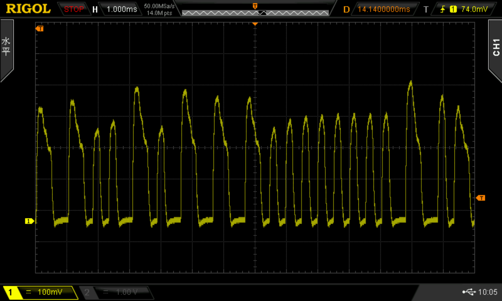
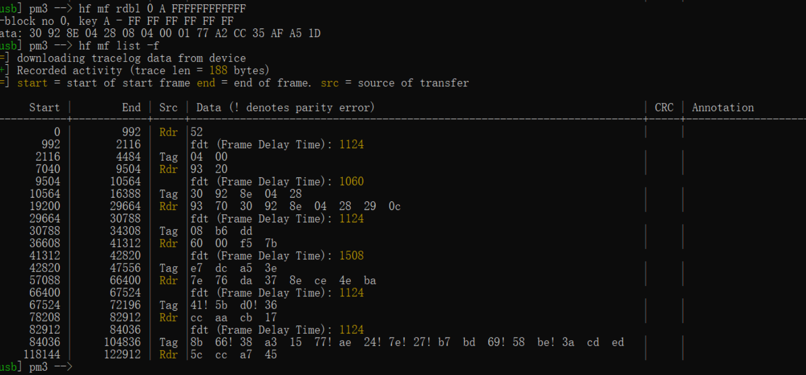
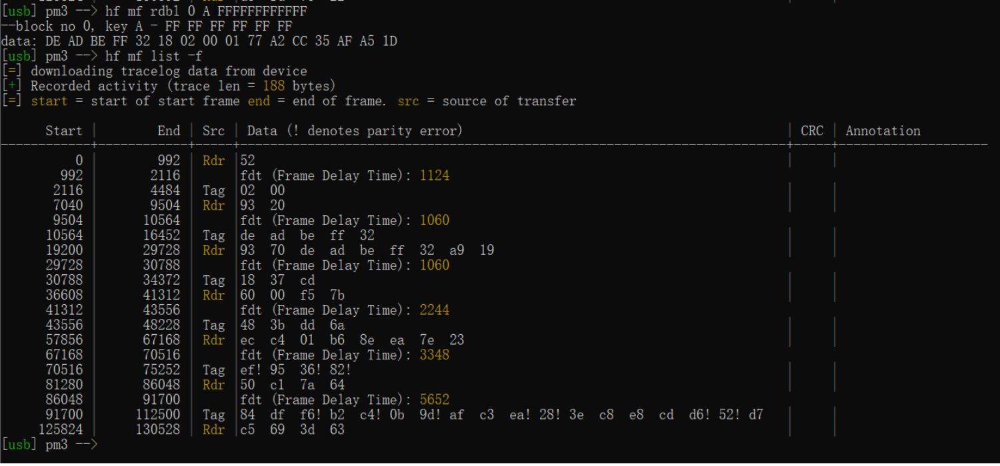
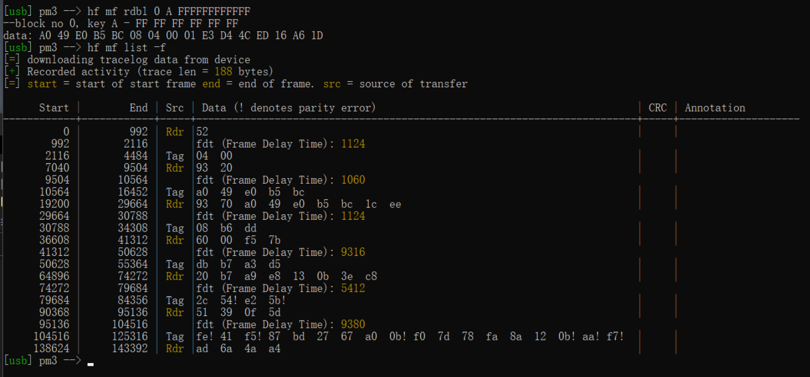
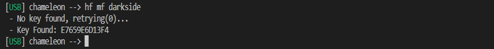
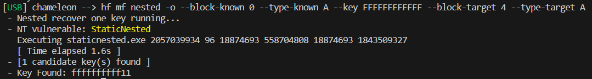

[nrf52_nfc_module_doc]: https://infocenter.nordicsemi.com/index.jsp?topic=%2Fcom.nordic.infocenter.nrf52832.ps.v1.1%2Fnfc.html

[nxp_rc522_datasheet]: https://www.nxp.com/docs/en/data-sheet/MFRC522.pdf

# ChameleonUltra

Why not keep using ATXMEGA128?
First of all, it is difficult to buy chips because the lead time for the main chip is too long, and because the price
has skyrocketed. Secondly, because the interaction speed of the ATXMEGA, emulation is slow, the decryption performance
of the READER mode cannot meet the needs, and the LF support cannot be added, so we have been trying to upgrade it, such
as using the latest ARM to replace the AVR framework, and the performance will definitely be greatly improved.

# Why nRF52840?

NRF52840 has a built-in NFC Tag-A module, but no one seems to care about it. After playing with HydraNFC's TRF7970A and
FlipperZero's ST25R3916, the developers found that they can only emulate MIFARE Classic with a very high FDT.
We accidentally tested the NFC of nRF52840, and found that it is not only surprisingly easy to emulate a complete MIFARE
Classic card, but also has very good emulation performance, friendly data flow interaction, and very fast response,
unlike the former which is limited by the SPI bus clock rate. We also found that it has ultra-low power consumption,
ultra-small size, 256kb/1M large RAM and Flash, also has BLE5.0 and USB2.0 FS, super CortexM4F, most importantly, it is
very cheap! This is undoubtedly a treasure discovery for us!

Below we will explain in detail how we exploited the performance of the NRF52840, and what seemingly impossible
functions have been realized with it!

# Supported functions

## High Frequency Attack

| Attack Type  |    Tag Type    | Whether the hardware supports | Does the software support | Whether the application layer supports |                     Note |
|--------------|:--------------:|------------------------------:|---------------------------|:--------------------------------------:|-------------------------:|
| Sniffing     |       No       |                            No | No                        |                   No                   |                          |
| MFKEY32 V2   | MIFARE Classic |                       Support | Support                   |                Support                 | MIFARE Classic Detection |
| Darkside     | MIFARE Classic |                       Support | Support                   |                Support                 |     Encrypted 4 bit NAck |
| Nested       | MIFARE Classic |                       Support | Support                   |                Support                 |     PRNG(Distance guess) |
| StaticNested | MIFARE Classic |                       Support | Support                   |                Support                 |   PRNG(2NT Fast Decrypt) |
| HardNested   | MIFARE Classic |                       Support | Support                   |          Not yet implemented           |                       No |
| Relay attack |   ISO14443A    |                       Support | Support                   |          Not yet implemented           |                       No |

## High Frequency emulation

| Card Type                      |    Encoding Type     | Whether the hardware supports | Does the software support | Whether the application layer supports |                                     Note |
|--------------------------------|:--------------------:|------------------------------:|---------------------------|:--------------------------------------:|-----------------------------------------:|
| Other than ISO14443A           |          No          |                            No | No                        |                   No                   | [NRF52 NFC Module][nrf52_nfc_module_doc] |
| NTAG 21x (210-218)             | ISO14443A/106 kbit/s |                       Support | Support                   |          Not yet implemented           |                                          |
| MIFARE Ultralight              | ISO14443A/106 kbit/s |                       Support | Support                   |          Not yet implemented           |                                          |
| MIFARE Ultralight Ev1          | ISO14443A/106 kbit/s |                       Support | Support                   |          Not yet implemented           |                                          |
| MIFARE Ultralight C            | ISO14443A/106 kbit/s |                       Support | Support                   |          Not yet implemented           |                                          |
| MIFARE Classic1K/2K/4K (4B/7B) | ISO14443A/106 kbit/s |                       Support | Support                   |                Support                 |                                          |
| MIFARE DESFire                 | ISO14443A High Rate  |       Only supported Low rate | Only supported Low rate   |          Not yet implemented           |                                          |
| MIFARE DESFire EV1             | ISO14443A High rate  |       Only supported Low rate | Only supported Low rate   |          Not yet implemented           |                      Backward compatible |
| MIFARE DESFire EV2             | ISO14443A High rate  |       Only supported Low rate | Only supported Low rate   |          Not yet implemented           |                                          |
| MIFARE Plus                    | ISO14443A High rate  |       Only supported Low rate | Only supported Low rate   |          Not yet implemented           |                                          |

## High Frequency Reader

| Card Type                       |    Encoding Type     |                Whether the hardware supports | Does the software support                    | Whether the application layer supports |                                       Note |
|---------------------------------|:--------------------:|---------------------------------------------:|----------------------------------------------|:--------------------------------------:|-------------------------------------------:|
| Non <13.56MHz or ISO14443A>     |          No          |                                           No | No                                           |                   No                   | [NXP RC522 Datasheet][nxp_rc522_datasheet] |
| NTAG 21x (210-218)              | ISO14443A/106 kbit/s |                                      Support | Support                                      |          Not yet implemented           |                                            |
| MIFARE Ultralight               | ISO14443A/106 kbit/s |                                      Support | Support                                      |          Not yet implemented           |                                            |
| MIFARE Ultralight Ev1           | ISO14443A/106 kbit/s |                                      Support | Support                                      |          Not yet implemented           |                                            |
| MIFARE Ultralight C             | ISO14443A/106 kbit/s |                                      Support | Support                                      |          Not yet implemented           |                                            |
| MIFARE Classic 1K/2K/4K (4B/7B) | ISO14443A/106 kbit/s |                                      Support | Support                                      |                Support                 |                                            |
| MIFARE DESFire                  | ISO14443A High Rate  | Supports low rates, or possibly higher rates | Supports low rates, or possibly higher rates |          Not yet implemented           |                                            |
| MIFARE DESFire EV1              | ISO14443A High rate  | Supports low rates, or possibly higher rates | Supports low rates, or possibly higher rates |          Not yet implemented           |                        Backward compatible |
| MIFARE DESFire EV2              | ISO14443A High rate  | Supports low rates, or possibly higher rates | Supports low rates, or possibly higher rates |          Not yet implemented           |                                            |
| MIFARE Plus                     | ISO14443A High rate  | Supports low rates, or possibly higher rates | Supports low rates, or possibly higher rates |          Not yet implemented           |                                            |

## Low Frequency Attack

| Vulnerability Type | Tag Type  | Whether the hardware supports | Does the software support | Whether the application layer supports | Note |
|--------------------|:---------:|------------------------------:|---------------------------|:--------------------------------------:|-----:|
| Sniffing           |  125KHz   |                       Support | Support                   |          Not yet implemented           |      |
| Brute Force        | EM410x ID |                       Support | Support                   |          Not yet implemented           |      |

## Low Frequency emulation

| Card Type                       | Encoding Type | Whether the hardware supports | Does the software support | Whether the application layer supports |                                          Note |
|---------------------------------|:-------------:|------------------------------:|---------------------------|:--------------------------------------:|----------------------------------------------:|
| Other than <125KHz/ASK/PSK/FSK> |      No       |                            No | No                        |                   No                   | Only 125 khz RF, Modulation ASK, FSK and PSK. |
| EM410x                          |      ASK      |                       Support | Support                   |                Support                 |                   EM4100 is support(AD 64bit) |
| T5577                           |      ASK      |                       Support | Support                   |          Not yet implemented           |                                               |
| EM4305                          |      ASK      |                       Support | Support                   |          Not yet implemented           |                                               |
| HID Prox                        |      FSK      |                       Support | Support                   |          Not yet implemented           |                                               |
| Indala                          |      PSK      |                       Support | Support                   |          Not yet implemented           |                                               |
| FDX-B                           |      ASK      |                       Support | Support                   |          Not yet implemented           |                                               |
| Paradox                         |      FSK      |                       Support | Support                   |          Not yet implemented           |                                               |
| Keri                            |      PSK      |                       Support | Support                   |          Not yet implemented           |                                               |
| AWD                             |      FSK      |                       Support | Support                   |          Not yet implemented           |                                               |
| ioProx                          |      FSK      |                       Support | Support                   |          Not yet implemented           |                                               |
| securakey                       |      ASK      |                       Support | Support                   |          Not yet implemented           |                                               |
| gallagher                       |      ASK      |                       Support | Support                   |          Not yet implemented           |                                               |
| PAC/Stanley                     |      ASK      |                       Support | Support                   |          Not yet implemented           |                                               |
| Presco                          |      ASK      |                       Support | Support                   |          Not yet implemented           |                                               |
| Visa2000                        |      ASK      |                       Support | Support                   |          Not yet implemented           |                                               |
| Viking                          |      ASK      |                       Support | Support                   |          Not yet implemented           |                                               |
| Noralsy                         |      ASK      |                       Support | Support                   |          Not yet implemented           |                                               |
| NexWatch                        |      PSK      |                       Support | Support                   |          Not yet implemented           |                                               |
| Jablotron                       |      ASK      |                       Support | Support                   |          Not yet implemented           |                                               |

## Low Frequency Reader

| Card Type                       | Encoding Type | Whether the hardware supports | Does the software support | Whether the application layer supports |                                          Note |
|---------------------------------|:-------------:|------------------------------:|---------------------------|:--------------------------------------:|----------------------------------------------:|
| Other than <125KHz/ASK/PSK/FSK> |      No       |                            No | No                        |                   No                   | Only 125 khz RF, Modulation ASK, FSK and PSK. |
| EM410x                          |      ASK      |                       Support | Support                   |                Support                 |                                               |
| T5577                           |      ASK      |                       Support | Support                   |             Support(Write)             |                                               |
| EM4305                          |      ASK      |                       Support | Support                   |          Not yet implemented           |                                               |
| HID Prox                        |      FSK      |                       Support | Support                   |          Not yet implemented           |                                               |
| Indala                          |      PSK      |                       Support | Support                   |          Not yet implemented           |                                               |
| FDX-B                           |      ASK      |                       Support | Support                   |          Not yet implemented           |                                               |
| Paradox                         |      FSK      |                       Support | Support                   |          Not yet implemented           |                                               |
| Keri                            |      PSK      |                       Support | Support                   |          Not yet implemented           |                                               |
| AWD                             |      FSK      |                       Support | Support                   |          Not yet implemented           |                                               |
| ioProx                          |      FSK      |                       Support | Support                   |          Not yet implemented           |                                               |
| securakey                       |      ASK      |                       Support | Support                   |          Not yet implemented           |                                               |
| gallagher                       |      ASK      |                       Support | Support                   |          Not yet implemented           |                                               |
| PAC/Stanley                     |      ASK      |                       Support | Support                   |          Not yet implemented           |                                               |
| Presco                          |      ASK      |                       Support | Support                   |          Not yet implemented           |                                               |
| Visa2000                        |      ASK      |                       Support | Support                   |          Not yet implemented           |                                               |
| Viking                          |      ASK      |                       Support | Support                   |          Not yet implemented           |                                               |
| Noralsy                         |      ASK      |                       Support | Support                   |          Not yet implemented           |                                               |
| NexWatch                        |      PSK      |                       Support | Support                   |          Not yet implemented           |                                               |
| Jablotron                       |      ASK      |                       Support | Support                   |          Not yet implemented           |                                               |

## Low Frequency Modulation

| Modulation Type |                                 wav |
|-----------------|------------------------------------:|
| PSK             |  |
| FSK             |  |
| ASK             |  |

# Ultra-low power consumption

It integrates a high-performance and low-power NFC module inside. When the NFC unit is turned on, the total current of
the chip is only 5mA @3.3V.
The underlying interaction is done independently by the NFC unit and does not occupy the CPU.
In addition, the nRF52840 itself is a high-performance low-power BLE chip, and the encryption and calculation process is
only 7mA @3.3V. It can greatly reduce the battery volume and prolong the working time. That is to say, the 35mAh 10mm*
40mm button lithium battery can guarantee to be charged once every half a year under the working condition of swiping
the card 8 times a day for 3 seconds each time. Full potential for everyday use.

# Not just UID, but a real and complete MIFARE Classic emulation

We can easily and completely emulate all data and password verification of all sectors, and can customize SAK, ATQA,
ATS, etc. Similar to an open CPU card development platform, 14A interaction of various architectures can be easily
realized.

# Super compatibility with low-power locks using batteries

The structure of the old Chameleon AVR is slow to start during emulation. Faced with a battery-powered low-power lock
and an integrated lock on the door, it will be frequently interrupted, and the verification interaction cannot be
completed completely, resulting in no response when swiping the card.

In order to reduce power consumption, the battery lock will send out a field signal as short as possible when searching
for a card, which is no problem for the original card, but it is fatal for the MCU emulated card. Cards or mobile smart
bracelets emulated by the MCU cannot wake up and respond in such a short time, so many battery locks cannot open the
door, which greatly reduces the user experience.

This project specially optimizes the start-up and interaction logic and antenna for low-power reading heads. After
testing a variety of common low-power reading heads, they can open the door perfectly by swiping the card.

# Ultra-fast response speed and low interaction delay(MIFARE Classic)

| Tag/Emulation        |                                      FDT                                      |                                "**_FDT_**" Rating                                |
|----------------------|:-----------------------------------------------------------------------------:|:--------------------------------------------------------------------------------:|
| Standard MIFARE Card |                                | &#x2B50;&#x2B50;&#x2B50;&#x2B50;&#x2B50;&#x2B50;&#x2B50;&#x2B50;&#x2B50;&#x2B50; |
| Chameleon Ultra      |                             |         &#x2B50;&#x2B50;&#x2B50;&#x2B50;&#x2B50;&#x2B50;&#x2B50;&#x2B50;         |
| Proxmark3 Rdv4.01    |  |                         &#x2B50;&#x2B50;&#x2B50;&#x2B50;                         |
| RedMi K30            |                              |                 &#x2B50;&#x2B50;&#x2B50;&#x2B50;&#x2B50;&#x2B50;                 |
| Chameleon Tiny       |                               |                     &#x2B50;&#x2B50;&#x2B50;&#x2B50;&#x2B50;                     |
| Flipper Zero         |                                   |                                 &#x2B50;&#x2B50;                                 |

# 256kB super large RAM cooperates with RC522 to enable attacks

| Attack Type  |                            CLI                             |
|--------------|:----------------------------------------------------------:|
| MFKEY32 V2   |          |
| Darkside     |          |
| Nested       |              |
| StaticNested |  |
| HardNested   |                        Coming Soon                         |
| Relay attack |                        Coming Soon                         |

# Hardware frame diagram

# Birth of the project

When the project got open-sourced, DXL shared a few notes in [issue #1](https://github.com/RfidResearchGroup/ChameleonUltra/issues/1#issuecomment-1455016381).

**Hardware:** ChameleonUltra and ChameleonLite hardware were carefully designed by Proxgrind team. They inherit the style of ChameleonTiny, which is very consistent with Olaf's style. Yes, whether it is Proxmark3 RDV4 or Chameleon Tiny, Olaf likes to reduce the size as much as possible under the extreme performance, making it easy to carry, unique in appearance and full of technology. At the same time, it is a pity that the volume of Chameleon Ultra brings inconvenience to most people for PCBA manufacturing and firmware development and testing. Therefore, we feel that we need to provide a development board based on ChameleonUltra with a larger volume. The components of this development board is packaged with common volume to make it easy to weld, and we also reserved GPIO interface and SWD interface. And this development board is also open source. If enthusiasts are interested, they can build a Chameleon Ultra from scratch. Of course, if there is no welding tool, we also provide formed development boards for sale (moderate price).

**Firmware:** Chameleon Ultra is a very powerful platform. We can develop various 14A protocol card simulations based on this platform. In terms of high-frequency card simulation, DXL has completed the development of high-performance MifareClassic Mini ->S50 ->S70 card. However, the development of cards for other technologies has not been completed, such as UL, UL-C, NTAG, etc. In terms of low-frequency card simulation, DXL has completed the development of EM410x, but the development of other technology cards has not been completed, such as FSK and PSK-related technology cards. For card reader, DXL has completed the reading, writing and decryption of M1 card, reading EM410x and writing to T5577. Others, such as the reading and writing of UL card and NTAG card, are not completed yet.

**Client:** At present, ChameleonUltra uses python to develop the CLI, cooperate with independent exe to perform the decryption task, and complete the decoupling of the business logic of the CLI and the decryption algorithm logic. Due to time reasons, DXL only completes commands such as device connection, M1 card data upload, M1 card detection log download and decryption, M1 card read and write block, and so on. The complete nested, rdsc, and autopwn instructions like PM3 have not yet been implemented, which may require our joint efforts. Finally, I believe that Chameleon Ultra is definitely not limited to CLI as a way of device interaction. Perhaps we can further develop PC-side GUI, and develop IOS and Android APP. USB+BLE support makes everything possible.
